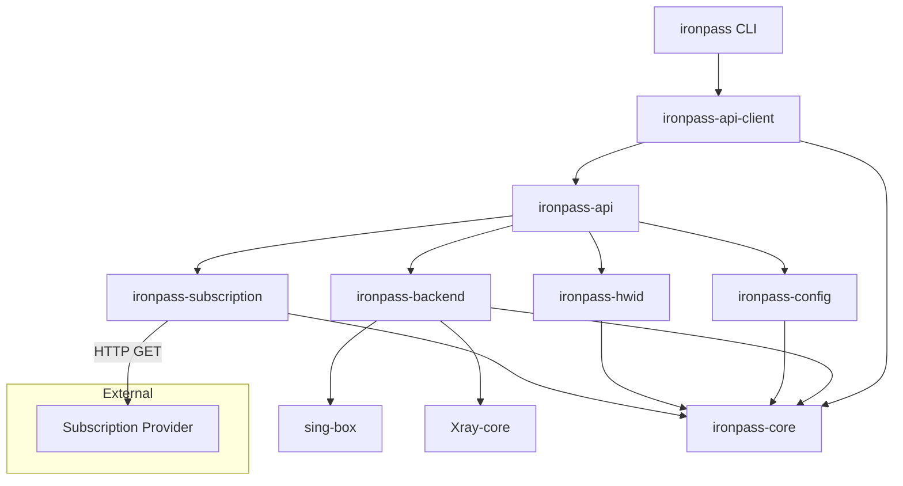

<!-- generated-by: gsd-doc-writer -->

# IronPass Architecture

This document describes the high-level architecture of the IronPass workspace, the responsibilities of each crate, the data flow for subscription fetching, the HWID retry state machine, placeholder detection scoring, metadata extraction, and the testing strategy.

## Table of Contents

- [System Overview](#system-overview)
- [Workspace Layout](#workspace-layout)
- [Component Diagram](#component-diagram)
- [Crate Responsibilities and Dependencies](#crate-responsibilities-and-dependencies)
- [Data Flow for the `fetch` Command](#data-flow-for-the-fetch-command)
- [HWID Retry State Machine](#hwid-retry-state-machine)
- [Placeholder Detection Scoring](#placeholder-detection-scoring)
- [Metadata Extraction Pipeline](#metadata-extraction-pipeline)
- [Testing Strategy](#testing-strategy)

## System Overview

IronPass is a Rust workspace that exposes a single binary, `ironpass`, for managing VPN subscriptions. At runtime the CLI parses arguments, loads configuration from the XDG directories, optionally fetches subscriptions over HTTP, parses them into a canonical `ProxyNode` representation, filters placeholder nodes, and either displays the result or starts a local proxy.

The architecture is layered:

- **Core** (`ironpass-core`) defines domain models and traits.
- **Subscription** (`ironpass-subscription`) implements fetching, parsing and placeholder detection.
- **HWID** (`ironpass-hwid`) generates and persists a stable device identifier.
- **Config** (`ironpass-config`) manages TOML configuration.
- **Backend** (`ironpass-backend`) provides proxy backend abstraction and configuration generators for sing-box and Xray-core.
- **API** (`ironpass-api`) exposes the `ironpassd` REST API and orchestrates subscriptions, HWID, config and proxy state.
- **API Client** (`ironpass-api-client`) is a typed HTTP client shared by the CLI and API DTOs.
- **CLI** (`ironpass-cli`) wires everything together behind a `clap` command-line interface.

## Workspace Layout

```
ironpass/
├── Cargo.toml
├── crates/
│   ├── ironpass-core/           # Domain models and shared traits
│   ├── ironpass-subscription/   # Fetch, parse and detect placeholders
│   ├── ironpass-hwid/           # HWID generation and device info
│   ├── ironpass-config/         # TOML config management
│   ├── ironpass-backend/        # Proxy backend abstraction and config generators
│   ├── ironpass-api/            # REST API daemon (ironpassd)
│   ├── ironpass-api-client/     # Typed HTTP client and shared DTOs
│   └── ironpass-cli/            # Binary and command handlers
```

## Component Diagram



- `CLI` dispatches to command handlers and talks to `ironpassd` via `ironpass-api-client`.
- `Subscription` owns the fetch/parse loop.
- `HWID` supplies identifiers used by fetchers.
- `Config` persists user settings.
- `Backend` generates sing-box/Xray-core configurations and is used by the `proxy` command.

## Crate Responsibilities and Dependencies

### `ironpass-core`

Defines shared domain types and abstractions.

Key types:

| Type                  | Purpose                                                    | File                                          |
|-----------------------|------------------------------------------------------------|-----------------------------------------------|
| `Protocol`            | VPN protocol enumeration (VLESS, VMess, Trojan, SS, etc.) | `crates/ironpass-core/src/models.rs`          |
| `Transport`           | Transport layer enumeration (TCP, WebSocket, gRPC, etc.)  | `crates/ironpass-core/src/models.rs`          |
| `Security`            | Security mode (None, TLS, Reality)                        | `crates/ironpass-core/src/models.rs`          |
| `ProxyNode`           | Canonical representation of a single proxy node           | `crates/ironpass-core/src/models.rs`          |
| `Subscription`        | Parsed subscription with nodes, traffic and metadata      | `crates/ironpass-core/src/models.rs`          |
| `SubscriptionMetadata`| Provider metadata (title, update interval, announce)      | `crates/ironpass-core/src/models.rs`          |
| `HwidInfo`            | Device fingerprint fields                                 | `crates/ironpass-core/src/models.rs`          |
| `Error`               | Unified error enum                                        | `crates/ironpass-core/src/error.rs`           |
| `SubscriptionFetcher` | Async trait for fetching subscriptions                    | `crates/ironpass-core/src/traits.rs`          |
| `NodeParser`          | Trait for parsing subscription text into nodes            | `crates/ironpass-core/src/traits.rs`          |
| `HwidProvider`        | Trait for HWID generation and device info                 | `crates/ironpass-core/src/traits.rs`          |

### `ironpass-subscription`

Implements the subscription lifecycle.

- `SubscriptionService` (`service.rs`) is the high-level facade used by the CLI.
- `HttpSubscriptionFetcher` (`fetcher.rs`) performs HTTP requests, HWID injection, retry logic, traffic parsing and metadata extraction.
- `SubscriptionParser` (`parser.rs`) auto-detects and parses Base64 lists, raw URI lists, Clash YAML and sing-box JSON.
- `PlaceholderPolicy` (`fetcher.rs`) scores nodes to detect provider placeholders.

### `ironpass-hwid`

`SystemHwidProvider` generates a SHA-256 digest from hostname, username, machine UID and device model, then persists it in `~/.config/ironpass/hwid.json`. It implements the `HwidProvider` trait.

### `ironpass-config`

`ConfigManager` loads and saves `config.toml` with `[general]`, `[subscription]`, `[hwid]` and `[logging]` sections.

### `ironpass-backend`

Proxy backend abstraction and configuration generators.

- `Backend` trait implemented by `SingBoxBackend` and `XrayBackend`.
- `BackendRegistry` resolves `BackendType` (including `Auto`) to a concrete backend.
- `CoreProcessManager` starts/stops the selected core binary.
- `singbox.rs` and `xray.rs` generate core-specific JSON configurations.

### `ironpass-api`

REST API daemon (`ironpassd`). Public surface:

- `ironpass_api::app`
- `ironpass_api::default_state`
- `ironpass_api::serve`
- `ironpass_api::models` (re-exported from `ironpass-api-client`)

Internal modules (`db`, `error`, `routes`, `state`) are private.

### `ironpass-api-client`

Typed HTTP client and shared DTOs.

- `ApiClient` (`client.rs`) wraps `reqwest` calls to the `ironpassd` REST API.
- `ApiClientError` (`error.rs`) enumerates typed client errors.
- `models` (`models.rs`) contains DTOs such as `StoredSubscription`, `NodeWithSubscription`, `StartProxyRequest`, `ProxyStatus`, etc.

### `ironpass-cli`

The binary crate. `main.rs` bootstraps tracing and `color-eyre`, then delegates to `commands::dispatch`. Each command has a dedicated private module in `crates/ironpass-cli/src/commands/`:

| Module            | Command              |
|-------------------|----------------------|
| `sub.rs`          | `fetch`, `sub`       |
| `hwid.rs`         | `hwid`               |
| `analyze.rs`      | `analyze`            |
| `proxy.rs`        | `proxy`              |
| `ping.rs`         | `ping`               |
| `completions.rs`  | `completions`        |
| `config_cmd.rs`   | `config`             |
| `backend.rs`      | `backend`            |
| `split_tunnel.rs` | `split-tunnel`       |
| `daemon.rs`       | `daemon`             |

## Data Flow for the `fetch` Command

```mermaid
sequenceDiagram
    participant CLI as ironpass CLI
    participant CLIENT as ironpass-api-client
    participant API as ironpass-api
    participant SVC as SubscriptionService
    participant FET as HttpSubscriptionFetcher
    participant HWID as SystemHwidProvider
    participant PAR as SubscriptionParser
    participant OUT as Output

    CLI->>CLIENT: resolve API URL
    CLI->>SVC: fetch_and_parse(url, hwid)
    SVC->>FET: fetch(url, hwid)
    FET->>FET: build_request(url, hwid)
    alt hwid provided
        FET->>HWID: get_device_info()
        FET->>FET: add x-hwid, x-device-model, x-device-os headers
    end
    FET->>Provider: HTTP GET
    Provider-->>FET: raw body + headers
    FET->>FET: execute_request
    FET->>FET: parse_response
    FET->>PAR: detect_format / parse
    PAR-->>FET: Vec<ProxyNode>
    FET->>FET: count placeholders
    FET->>FET: extract metadata + subscription-userinfo
    alt all placeholders and no hwid
        FET->>HWID: generate()
        FET->>Provider: retry with x-hwid
        Provider-->>FET: retry response
        FET->>FET: re-parse
    end
    FET-->>SVC: Subscription
    SVC-->>CLI: Subscription
    CLI->>CLI: filter placeholders (unless --include-placeholders)
    CLI->>CLI: sort nodes
    CLI->>OUT: print table / JSON
```

## HWID Retry State Machine

The retry logic lives in `HttpSubscriptionFetcher::apply_retry_policy`.

```mermaid
stateDiagram-v2
    [*] --> FetchWithoutHwid
    FetchWithoutHwid --> DeviceLimit : x-hwid-limit: true
    DeviceLimit --> [*] : Error::DeviceLimitExceeded

    FetchWithoutHwid --> ParseResponse
    ParseResponse --> Done : has real nodes
    ParseResponse --> PlaceholdersOnly : all nodes are placeholders

    PlaceholdersOnly --> RetryWithHwid : auto_hwid_retry enabled
    RetryWithHwid --> DeviceLimit : x-hwid-limit: true
    RetryWithHwid --> ParseResponse : response received
    RetryWithHwid --> RetryExhausted : max_hwid_retries reached
    RetryExhausted --> [*] : Error

    PlaceholdersOnly --> [*] : auto_hwid_retry disabled
    Done --> [*] : return Subscription
```

Rules:

1. If the server responds with `x-hwid-limit: true`, fail immediately with `Error::DeviceLimitExceeded`.
2. If the user supplied a HWID and the response is still placeholder-only, fail without retry (the provider has rejected that HWID or the account is at the device limit).
3. If no HWID was supplied and the response is placeholder-only, generate a new HWID and retry up to `FetchOptions::max_hwid_retries` times.
4. If retries are exhausted and the response is still placeholder-only, return an error.

## Placeholder Detection Scoring

`PlaceholderPolicy` decides whether a node is a provider placeholder. It uses two mechanisms:

### Hard sentinels (always rejected)

A node is immediately flagged if any of the following is true:

- Server address is `0.0.0.0`.
- Port is `0` or `1`.
- UUID equals the nil UUID (`00000000-0000-0000-0000-000000000000`) or a user-added dummy UUID.
- Server address was explicitly added via `add_dummy_address` and is not a built-in loopback address.

### Score-based detection

If no hard sentinel matches, independent criteria contribute to a score:

| Criterion                              | Points |
|----------------------------------------|--------|
| Server matches a dummy address/prefix  | 1      |
| Port is in the dummy port set          | 1      |
| UUID matches a dummy UUID              | 1      |
| Server matches a sentinel domain       | 1      |

A node is a placeholder if `score >= score_threshold`.

### Built-in policies

- `PlaceholderPolicy::default()` uses threshold `2`, dummy addresses `{0.0.0.0}`, dummy ports `{0, 1}` and the nil UUID. It is conservative and avoids false positives.
- `PlaceholderPolicy::strict()` adds loopback addresses, common sentinel domains (`example.com`, `test.com`, `invalid`, `localhost`) and additional dummy ports (`2`, `3`, `80`, `8080`).

The CLI uses `is_placeholder_node`, which applies the default policy.

## Metadata Extraction Pipeline

Subscription metadata is collected from two sources and merged, with HTTP headers taking precedence.

### 1. HTTP response headers

`extract_header_metadata` reads:

- `profile-title`
- `profile-update-interval`
- `profile-web-page-url`
- `announce`

Values prefixed with `base64:` are decoded automatically. All recognised header names and decoded values are also stored in `metadata.headers`.

### 2. Inline body metadata

`extract_inline_metadata` scans `key=value` lines in the response body. It supports the same keys plus the plural `announces`. If the entire body is Base64, it is decoded first.

### 3. Merge

`merge_metadata` copies fields from inline metadata only when the corresponding header field is absent. This mirrors the behaviour of many providers where headers are authoritative.

### Traffic and expiry

The `subscription-userinfo` header is parsed into:

- `traffic_used` = `upload + download`
- `traffic_total` = `total`
- `expires_at` = `expire` as a UTC timestamp

## Testing Strategy

IronPass uses Rust's built-in test framework (`cargo test`) with additional support from `wiremock` and `mockall`.

### Unit tests

Each crate contains inline `#[cfg(test)]` modules covering its public API. `ironpass-subscription` has over 100 unit tests for:

- VLESS, VMess, Trojan and Shadowsocks URI parsing.
- Clash YAML and sing-box JSON parsing.
- Format detection.
- Placeholder detection with default and strict policies.
- `subscription-userinfo` parsing.

### Integration tests

- `crates/ironpass-subscription/tests/hwid_retry_tests.rs` — verifies the HWID retry state machine using a `wiremock` server and a mocked `HwidProvider`.
- `crates/ironpass-subscription/tests/subscription_metadata_tests.rs` — verifies header and inline metadata extraction, precedence rules, and traffic parsing.
- `crates/ironpass-subscription/tests/placeholder_policy_tests.rs` — verifies default, strict and custom placeholder policies.
- `crates/ironpass-api/tests/api_integration.rs` — verifies the `ironpassd` HTTP API surface using an in-memory database and a mocked `HwidProvider`.
- `crates/ironpass-cli/tests/cli_api_integration.rs` — end-to-end CLI tests against a spawned `ironpassd` instance.
- `crates/ironpass-cli/tests/fetch_integration_tests.rs` — five end-to-end CLI tests that exercise the `ironpass fetch` command against a `wiremock` server, covering automatic HWID retry, explicit HWID, placeholder inclusion, device limit errors, and JSON output.

### Running tests

```bash
# Full workspace
cargo test --workspace

# Single crate
cargo test -p ironpass-subscription

# With output
cargo test --workspace -- --nocapture
```
